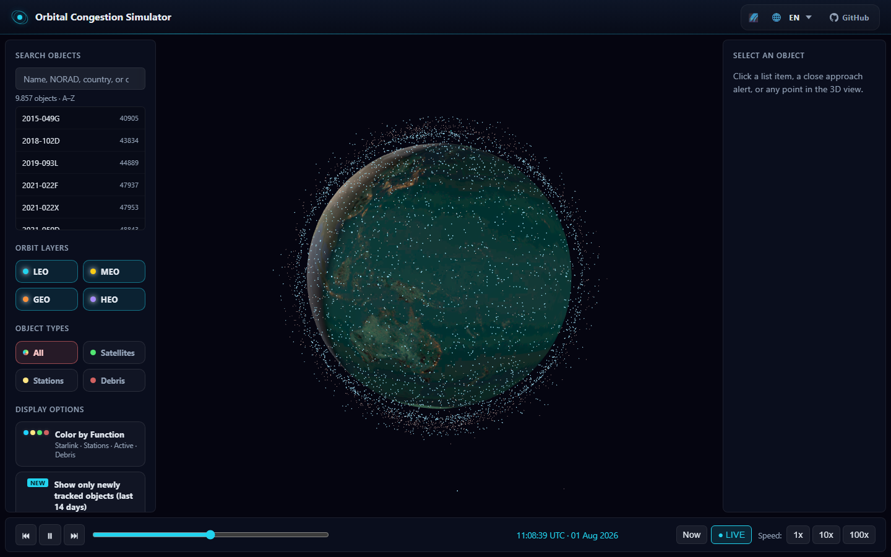

# Orbital Congestion Simulator

> Real-time 3D visualization of Earth orbit congestion using CelesTrak TLE data and SGP4 orbital propagation.

**Live demo:** [https://orbital-congestion-simulator.vercel.app](https://orbital-congestion-simulator.vercel.app)



## What it does

Orbital Congestion Simulator renders thousands of satellites and debris fragments orbiting Earth in real time. It uses Two-Line Element (TLE) data from CelesTrak and propagates each object with the SGP4 algorithm via [satellite.js](https://github.com/shashwatak/satellite-js).

Explore orbit layers (LEO, MEO, GEO, HEO), filter by congestion type, click any object to inspect its orbital parameters, and scrub through time to see how the orbital environment evolves.

## Features

- **Live 3D globe** with instanced orbital points and day/night shading
- **Orbit layers & filters** — LEO / MEO / GEO / HEO, satellites / stations / debris, search
- **Close-approach alerts** — next-24h scanning with verification UI
- **Historical event replays** — seven landmark collisions, ASAT tests, docking, and breakups
- **Kessler “Future Projection”** — interactive what-if debris growth panel
- **Satellite Spotter** — mobile sky guide using device sensors
- **i18n** — English, Turkish, German, Russian, Chinese
- **Deep links** — `?object=<NORAD>` / `?event=<id>`
- **Admin analytics overlay** (optional Firebase RTDB) — local PIN, visitor metrics
- **Automated TLE refresh** — GitHub Actions twice weekly

## Why it matters

Earth orbit is increasingly crowded. More than 27,000 tracked objects share near-Earth space, and collisions like Iridium 33–Cosmos 2251 demonstrated the Kessler Syndrome risk — where one collision creates debris that triggers more collisions. Operators like SpaceX perform hundreds of collision-avoidance maneuvers each year. This simulator makes that invisible traffic visible.

## Tech stack

| Layer | Technology |
|-------|------------|
| Build | Vite 6 + TypeScript (strict) |
| 3D | Three.js |
| Orbital mechanics | satellite.js (SGP4) |
| Data | CelesTrak TLE (static JSON) |
| Deploy | [Vercel](https://orbital-congestion-simulator.vercel.app) |

## Getting started

```bash
git clone https://github.com/muhammet842/orbital-congestion-simulator.git
cd orbital-congestion-simulator
npm install
npm run fetch-tle
npm run dev
```

Open `http://localhost:5173` in your browser.

## How to use

On first visit the app asks you to **choose a language**, then walks through the UI step by step with on-screen highlights (globe, search/filters, details, close approaches, historical events, time bar, Future Projection). Use **Skip** anytime; reopen the tour with the **?** button in the header.

Deep links: `?object=<NORAD>` and `?event=<id>`.

## Data source

TLE data is fetched from [CelesTrak](https://celestrak.org/):

- Active satellites (capped at 7,000 — Starlink/OneWeb sub-capped to leave room for other constellations)
- Debris catalog (capped at 3,000 — Cosmos 2251, Fengyun-1C, Iridium 33, analyst objects)
- Space stations (ISS, Tiangong, etc.)

Output: `public/data/tle.json` — up to **10,000 objects**, deduplicated by NORAD ID.

A [GitHub Actions workflow](.github/workflows/tle-refresh.yml) refreshes this dataset automatically twice a week (Monday & Thursday) and commits the result, so the deployed app stays under the in-app 3-day staleness warning threshold. To refresh it manually:

```bash
npm run fetch-tle
```

### “NEW” objects filter

Objects can carry a `firstSeenAt` stamp when they first appear in an automated fetch relative to the previous catalog snapshot. The UI “newly tracked (last 14 days)” filter uses that stamp — it means **first seen by this app’s pipeline**, not necessarily physical formation or launch date. Stamps accumulate across refreshes; a cold/empty baseline does not mark the whole catalog as new. See [docs/NEW_OBJECTS.md](docs/NEW_OBJECTS.md).

## Orbital mechanics

Each object is propagated with **SGP4** (Simplified General Perturbations 4), the standard model used by NORAD for TLE-based prediction. Positions are computed in Earth-Centered Inertial (ECI) coordinates and scaled for Three.js display (1 unit = Earth radius).

Orbit layers are classified by altitude and eccentricity:

| Layer | Altitude |
|-------|----------|
| LEO | &lt; 2,000 km |
| MEO | 2,000 – ~32,000 km |
| GEO | ~35,786 km ± 500 km |
| HEO | High eccentricity (&gt; 0.25) |

## 3D models

`public/models/sat_leo.glb` is the bundled LEO satellite mesh. Stations, cargo craft, cubesats, and debris use **distinct procedural silhouettes** (see `SatelliteModelLoader`) so types stay visually readable without multi‑MB artist GLBs. Dropping additional `.glb` files at the paths in `modelResolver.ts` and marking them as bundled will take priority automatically.

## Earth texture

Earth texture sourced from [NASA Visible Earth](https://visibleearth.nasa.gov/) (Blue Marble). Stored locally at `public/textures/earth.jpg`.

## Ops & admin

- Firebase rules and deploy notes: [firebase/README.md](firebase/README.md)
- Feature / architecture notes: [docs/FEATURES.md](docs/FEATURES.md)
- Operations checklist (TLE refresh, Firebase publish): [docs/OPERATIONS.md](docs/OPERATIONS.md)

The admin overlay (Ctrl+Shift+A) is a **local debug panel**. The PIN is hashed on-device (SHA-256); it is not remote authentication.

## Stardance / NASA

Built for the [Hack Club Stardance](https://stardance.hackclub.com/) competition in collaboration with NASA themes on space sustainability and orbital debris awareness.

## License

MIT
